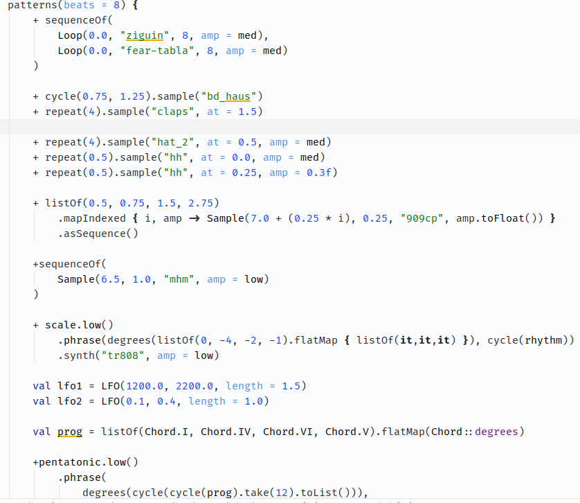

# punkt - Kotlin Punk
A live coding music library/environment for Kotlin. For software developers that want to dive into live coding music.

Demo: https://youtu.be/94xzNW6hxR8

[](https://youtu.be/94xzNW6hxR8?t=120)

## Rationale
* **minimal** - just a sequencer playing samples and synths designed in SuperCollider  
* **easy to install** - a library + template project, just `git clone`, run and enjoy
* **no custom IDE** - could be started directly from IntelliJ IDEA or command line with any Kotlin-aware editor 
* **data-oriented** - patterns and melodies represented as data structure, making it easy to test and visualize

### How to start
0. Install SuperCollider
1. Clone template project `git clone punkt-template`
2. Start SuperCollider and run `punkt.scd`
3. Run `Main.kt` in `punkt-template`
4. Profit! Just edit `src/main/kotlin/live.kts` in your favourite editor for live-coding 

### Why Kotlin?
* **statically typed, compiled** - you get code completion and compile-time errors for free
* **sequence API** - great standard library with lazy immutable sequences for making patterns
* **DSL builders** - extension methods and operator overloading makes it easy to create powerful DSLs 
* **scripting** - a file watcher and API for compiling/evaluating script whenever it changes
* **coroutines** - makes trivial to trigger asynchronous event from anywhere in your code
* **mainstream** - it's great to learn Clojure or Haskell, but it's even better that your project uses technology that reaches lots of potential users ;) 

### Minimal example

```kotlin
    patterns(beats = 8) {
        + repeat(1).sample("bd_haus")       
    }
```
Plays "bd_haus" sample every beat.

What happened here? `punkt` highly relies on durations to create patterns. If we want to play "bd_haus" sample every
beat, we could specify this by a list of beats, like `listOf(0, 1, 2, 3, ...)`. We could use `rangeTo` function (e.g. `0..7`) to
create a fixed range of beats. In `punkt` instead, you specify the durations *between* the beats, and a
*starting point* - which defaults to 0. This has some advantages:
 1. in simple cases, you repeat single value or cycle through small series of values
 2. this creates infinite sequence of beats, which is helpful if you don't know upfront how many beats you need ;) 
 that's why we need to narrow the resulting collection to fixes number of beats with this `patterns(beats = 8) {..}` 
 function.
 
 Another example: 4 on the floor beat:
 ```kotlin
     patterns(beats = 8) {
         + repeat(1).sample("bd_haus") // every beat starting from 0
         + repeat(2).sample("claps", at = 1.0) // every even beat, starting from 1     
         + repeat(1).sample("hat_2", at = 0.5, amp = 0.5f) // every beat, starting from 0.5
     }
 ```
Evaluates to:

| sample    | played at beats               |
|-----------|-------------------------------|
| "bd_haus" | [0,1,2,3,4,5,6,7]             |
| "claps"   | [1,3,5,7]                     |
| "hat_2"   | [0.5,1.5,2.5,3.5,4.5,5.5,6.5] | 

### Melody phrases
`punkt` also uses similar technique to create melodies. But melodies, apart from time when the sound should play,
require a note (pitch), which should play. To make it more musically correct, these notes should be part
of some musical scale. That's why we start by creating a `scale` object using DSL from `scale` package:

```kotlin
    val scale = Scale(C.sharp(), minor)
```
*The notes of C# minor are: C#,D#,E,F#,G#,A,B (https://en.wikipedia.org/wiki/C-sharp_minor)*

Then we can use `phrase` function, which takes sequence of degrees of given scale and sequence of durations to create a melody: 
```kotlin
    patterns(beats = 8) {
        + scale.low()
            .phrase(
                degrees(listOf(0,-4,-2,-1).flatMap { listOf(it,it,it) }),
                cycle(0.75, 0.75, 0.5))
            .synth("tr808", amp = 0.2f)
    }
```
This creates following notes:

| beats        | note | degree |
|--------------|------|--------|
| 0, 0.75, 1.5 | C#   |     0  |
| 2, 2.75, 3.5 | F#   |    -4  |
| 4, 4.75, 5.5 | A    |    -2  |
| 6, 6.75, 7.5 | A    |    -1  |

Which is the "Shape of you" bassline ;)

### More examples
TB-303 pentatonic arpeggio with LFO
```kotlin
    val pentatonic = Scale(C.sharp(), pentatonic)
    val lfo = LFO(1000.0, 3200.0, length = 1.5)
    
    patterns(beats = 8) {
        + pentatonic.low()
            .phrase(degrees(cycle(cycle((0..4)).take(10).toList())), cycle(0.25))
            .synth("tb303", amp = 0.2f)
            .params("sus" to 0.3, "dec" to 0.2, "start" to 100)
            .lfo(lfo, "cutoff")
    }
``` 

4-step chord progression with lead synth
```kotlin
    val scale = Scale(C.sharp(), minor)
    val progression = listOf(Chord.I, Chord.IV, Chord.VI, Chord.VII)

    patterns(beats = 8) {
        + scale
            .phrase(
                progression.flatMap { listOf(it, null, it) }.toDegrees(),
                cycle(1.0, 0.25, 0.75)
            )
            .synth("plucklead", amp = 0.25f)
            .params("cutoff" to 1500)
    }
```

### Inspirations
* **ORCA** - simplicity (just a sequencer)
* **openRNDR** - script-driven live coding
* **leipzig** - data-orientation
* **FoxDot/Tidal** - synth design, Dirt sampler

### Roadmap
* OSC/MIDI out
* OSC/MIDI in
* add effects on separate channels
* pattern randomization
* visualization

### License
Copyright © 2020- Piotr Jagielski

Punkt is licensed under the Apache License, Version 2.0. See LICENSE for the full license text.


